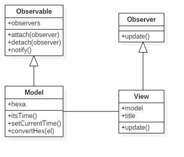

# HexaTime
Transform the background color with current time (Javascript ES6)

Demo : https://mcampourcy.github.io/HexaTime/

Takes the current hh:mm:ss and convert it in HSL (in hexa in the first place, but eh, it's nicer like that)

Small exercice to test the Observer pattern in ES6

